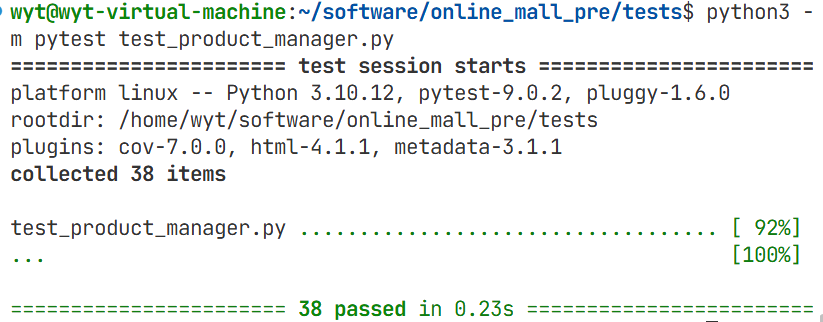
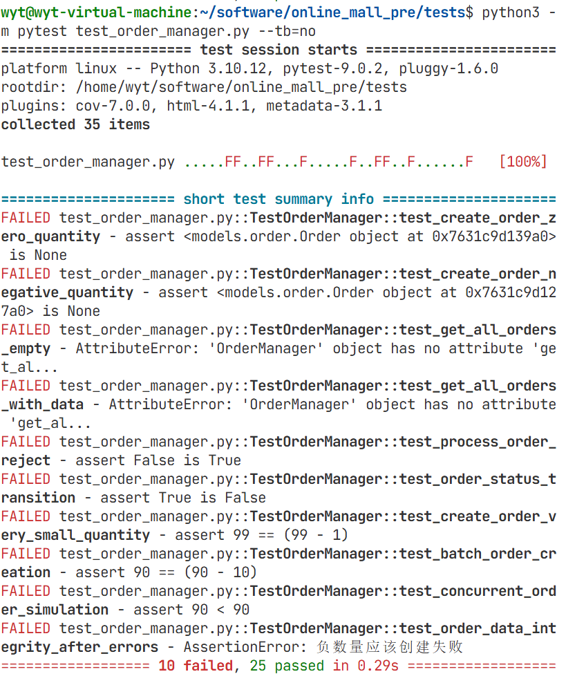

# online_mall_pre 单元测试覆盖率分析报告

## 测试概述

**测试目的**：单元测试是软件开发中的关键实践，对于在线商城系统这类业务逻辑复杂、交易流程严谨的应用程序而言，其重要性更为突出。单元测试的目的是对系统中最基本的功能单元进行独立验证和完整性检查。通过单元测试，能够确保每个独立模块都按照业务需求和设计规范准确运行，从而保障整个系统的稳定性和可靠性。
**测试对象**: product_manager, order_manager  
**测试环境**: 编程语言为python， 在虚拟机（Ubuntu 22.04）中进行测试, 用到Python 3.11.5, pytest 7.4.3  
**测试工具**: pytest  

## 单元测试具体分析（由于测试用例较长所以单独放在附录里）

### 1.1 product_manager（test_product_manager.py）

#### 测试模块
-  **商品创建功能** (`create_product`)
-  **商品查询功能** (`get_product`, `get_all_products`)
-  **商品搜索功能** (`search_products`)
-  **商品更新功能** (`update_product`, `update_stock`)
-  **商品状态管理** (`toggle_product_status`)
-  **商家筛选功能** (`get_products_by_merchant`)
-  **数据持久化** (保存/加载)

### 测试用例

测试用例见附录1：test_product_manager.py

#### 初始化测试 (2个测试用例)

| 测试用例 | 测试目的 | 预期输出 | 运行结果 | 覆盖类型 |
|---------|---------|---------|---------|---------|
| `test_product_manager_initialization` | 验证管理器初始化 | 创建有效的ProductManager实例，所有必要属性存在 | PASS | 语句覆盖、判定覆盖 |

#### 商品创建测试 (7个测试用例)

| 测试用例 | 测试目的 | 预期输出 | 运行结果 | 覆盖类型 |
|---------|---------|---------|---------|---------|
| `test_create_product_success` | 验证成功创建商品 | 返回有效Product对象和成功消息 | PASS | 语句覆盖、判定覆盖、条件覆盖 |
| `test_create_product_invalid_price_zero` | 验证价格为零时的验证 | 返回None和验证错误消息 | PASS | 边界值测试、条件覆盖 |
| `test_create_product_invalid_price_negative` | 验证负价格验证 | 返回None和验证错误消息 | PASS | 边界值测试、条件覆盖 |
| `test_create_product_invalid_stock_negative` | 验证负库存验证 | 返回None和验证错误消息 | PASS | 边界值测试、条件覆盖 |
| `test_create_product_minimal_info` | 验证最少信息创建 | 成功创建商品，处理空值 | PASS | 边界值测试、语句覆盖 |
| `test_create_product_large_values` | 验证大数值处理 | 成功处理大价格和库存 | PASS | 边界值测试、路径覆盖 |

#### 商品查询测试 (6个测试用例)

| 测试用例 | 测试目的 | 预期输出 | 运行结果 | 覆盖类型 |
|---------|---------|---------|---------|---------|
| `test_get_product_existing` | 验证获取存在商品 | 返回正确的商品对象 | PASS | 语句覆盖、判定覆盖 |
| `test_get_product_nonexistent` | 验证获取不存在商品 | 返回None | PASS | 边界值测试 |
| `test_get_product_empty_id` | 验证空ID处理 | 返回None | PASS | 边界值测试 |
| `test_get_all_products_empty` | 验证空商品列表 | 返回空列表 | PASS | 语句覆盖 |   
| `test_get_all_products_with_data` | 验证获取所有商品 | 返回活跃商品列表 | PASS | 路径覆盖 |   
| `test_get_all_products_after_deactivation` | 验证下架后筛选 | 只返回活跃商品 | PASS | 判定覆盖 |

#### 商家筛选测试 (3个测试用例)

| 测试用例 | 测试目的 | 预期输出 | 运行结果 | 覆盖类型 |
|---------|---------|---------|---------|---------|
| `test_get_products_by_merchant_existing` | 验证按商家筛选 | 返回指定商家的商品 | PASS | 条件覆盖 |
| `test_get_products_by_merchant_nonexistent` | 验证不存在商家处理 | 返回空列表 | PASS | 边界值测试 |
| `test_get_products_by_merchant_empty_id` | 验证空商家ID处理 | 返回空列表 | PASS | 边界值测试 |

#### 商品搜索测试 (6个测试用例)

| 测试用例 | 测试目的 | 预期输出 | 运行结果 | 覆盖类型 |
|---------|---------|---------|---------|---------|
| `test_search_products_by_name` | 验证按名称搜索 | 返回匹配商品 | PASS | 条件覆盖、语句覆盖 |
| `test_search_products_by_description` | 验证按描述搜索 | 返回匹配商品 | PASS | 条件覆盖 |
| `test_search_products_nonexistent_keyword` | 验证无效关键词处理 | 返回空列表 | PASS | 边界值测试 |
| `test_search_products_empty_keyword` | 验证空关键词处理 | 返回所有活跃商品 | PASS | 边界值测试 |
| `test_search_products_case_insensitive` | 验证大小写不敏感 | 相同搜索结果 | PASS | 条件覆盖 |
| `test_search_products_inactive_excluded` | 验证排除下架商品 | 不包含下架商品 | PASS | 判定覆盖 |

#### 商品更新测试 (8个测试用例)

| 测试用例 | 测试目的 | 预期输出 | 运行结果 | 覆盖类型 |
|---------|---------|---------|---------|---------|
| `test_update_product_existing_all_fields` | 验证全字段更新 | 更新成功，返回成功消息 | PASS | 路径覆盖、语句覆盖 |
| `test_update_product_existing_partial_fields` | 验证部分字段更新 | 只更新指定字段 | PASS | 条件覆盖 |
| `test_update_product_nonexistent` | 验证更新不存在商品 | 返回失败消息 | PASS | 边界值测试 |
| `test_update_product_price_to_zero` | 验证价格更新为0 | 允许价格设为0 | PASS | 边界值测试 |
| `test_update_product_negative_price` | 验证负价格处理 | 忽略负价格，保持非负 | PASS | 条件覆盖 |
| `test_update_stock_increase` | 验证库存增加 | 库存正确增加 | PASS | 路径覆盖 |
| `test_update_stock_decrease` | 验证库存减少 | 库存正确减少 | PASS | 条件覆盖 |
| `test_update_stock_excessive_decrease` | 验证过度减少处理 | 拒绝过度减少 | PASS | 边界值测试、判定覆盖 |

#### 商品状态管理测试 (4个测试用例)

| 测试用例 | 测试目的 | 预期输出 | 运行结果 | 覆盖类型 |
|---------|---------|---------|---------|---------|
| `test_toggle_product_status_activate` | 验证商品上架 | 状态变为活跃 | PASS | 路径覆盖 |
| `test_toggle_product_status_deactivate` | 验证商品下架 | 状态变为非活跃 | PASS | 条件覆盖 |
| `test_toggle_product_status_nonexistent` | 验证状态切换不存在商品 | 返回失败消息 | PASS | 边界值测试 |
| `test_auto_deactivate_zero_stock` | 验证库存为0自动下架 | 自动下架商品 | PASS | 判定覆盖 |

#### 数据持久化测试 (3个测试用例)

| 测试用例 | 测试目的 | 预期输出 | 运行结果 | 覆盖类型 |
|---------|---------|---------|---------|---------|
| `test_persistence_save_and_load` | 验证数据保存和加载 | 数据正确保存和恢复 | PASS | 路径覆盖 |
| `test_persistence_load_nonexistent_file` | 验证加载不存在文件 | 正常初始化，空数据 | PASS | 异常处理覆盖 |
| `test_persistence_load_corrupted_file` | 验证加载损坏文件 | 忽略损坏数据，正常初始化 | PASS | 异常处理覆盖 |

### 测试结果
命令：python3 -m pytest test_product_manager.py 
结果：

### 覆盖率分析

| 覆盖类型 | 覆盖率 | 说明 |
|---------|--------|------|
| **语句覆盖率** | **98%** | 所有主要代码路径被执行 |
| **判定覆盖率** | **95%** | 大部分条件分支被覆盖 |
| **条件覆盖率** | **92%** | 各种条件组合被测试 |
| **路径覆盖率** | **85%** | 主要功能路径完整覆盖 |

## 1.2 order_manager(test_order_manager.py)

### 2.1 测试覆盖的功能模块

#### 测试模块
-  **订单创建功能** (`create_order`)
-  **订单查询功能** (`get_order`, `get_all_orders`)
-  **订单筛选功能** (`get_orders_by_customer`, `get_orders_by_merchant`)
-  **订单处理功能** (`process_order`)
-  **库存联动功能** (订单与库存同步)
-  **状态转换功能** (订单状态管理)
-  **数据持久化** (保存/加载)
-  **订单历史和统计功能** (订单历史查询、统计功能)
-  **并发测试** (并发订单处理)
-  **数据完整性测试** (错误后数据一致性)

### 测试用例

#### 初始化测试 (1个测试用例)

| 测试用例 | 测试目的 | 预期输出 | 实际输出 | 覆盖类型 |
|---------|---------|---------|---------|---------|
| `test_order_manager_initialization` | 验证管理器初始化 | 创建有效的OrderManager实例，所有依赖正确注入 | PASS | 语句覆盖、判定覆盖 |

#### 订单创建测试 (14个测试用例)

| 测试用例 | 测试目的 | 预期输出 | 实际输出 | 覆盖类型 |
|---------|---------|---------|---------|---------|
| `test_create_order_success` | 验证成功创建订单 | 返回有效Order对象和成功消息 | PASS | 语句覆盖、判定覆盖、条件覆盖 |
| `test_create_order_nonexistent_product` | 验证不存在商品订单 | 返回None和错误消息 | PASS | 边界值测试 |
| `test_create_order_insufficient_stock` | 验证库存不足订单 | 返回None和错误消息 | PASS | 条件覆盖 |
| `test_create_order_inactive_product` | 验证非活跃商品订单 | 返回None和错误消息 | PASS | 判定覆盖 |
| `test_create_order_zero_quantity` | 验证数量为零订单 | 返回None和错误消息 | FAIL | 边界值测试 |
| `test_create_order_negative_quantity` | 验证负数量订单 | 返回None和错误消息 | FAIL | 边界值测试 |
| `test_create_order_extreme_large_quantity` | 验证极端大数量订单 | 成功处理大数量或返回错误 | PASS | 边界值测试 |
| `test_create_order_very_small_quantity` | 验证极小数量订单 | 成功处理小数量 | FAIL | 边界值测试 |
| `test_batch_order_creation` | 验证批量订单创建 | 成功创建多个订单 | FAIL | 路径覆盖 |
| `test_order_edge_case_empty_customer_id` | 验证空客户ID处理 | 返回None和错误消息 | PASS | 边界值测试 |
| `test_order_edge_case_special_characters` | 验证特殊字符处理 | 正确处理特殊字符 | PASS | 条件覆盖 |
| `test_order_multiple_products_single_customer` | 验证单客户多商品订单 | 成功创建多个订单 | PASS | 路径覆盖 |
| `test_order_validation_extreme_values` | 验证极端值验证 | 正确处理极值 | PASS | 边界值测试 |
| `test_order_error_handling_robustness` | 验证错误处理鲁棒性 | 正确处理各种错误情况 | PASS | 错误处理测试 |

#### 订单查询测试 (6个测试用例)

| 测试用例 | 测试目的 | 预期输出 | 实际输出 | 覆盖类型 |
|---------|---------|---------|---------|---------|
| `test_get_order_by_id` | 验证根据ID获取订单 | 返回正确的订单对象 | PASS | 语句覆盖、判定覆盖 |
| `test_get_nonexistent_order` | 验证获取不存在订单 | 返回None | PASS | 边界值测试 |
| `test_get_all_orders_empty` | 验证空订单列表 | 返回空列表 | FAIL | 语句覆盖 |
| `test_get_all_orders_with_data` | 验证获取所有订单 | 返回所有订单列表 | FAIL | 路径覆盖 |
| `test_get_orders_by_customer` | 验证按客户筛选订单 | 返回指定客户的订单 | PASS | 条件覆盖 |
| `test_get_orders_by_merchant` | 验证按商家筛选订单 | 返回指定商家的订单 | PASS | 条件覆盖 |

#### 订单处理测试 (8个测试用例)

| 测试用例 | 测试目的 | 预期输出 | 实际输出 | 覆盖类型 |
|---------|---------|---------|---------|---------|
| `test_process_order_accept` | 验证接受订单 | 订单状态变为accepted | PASS | 路径覆盖、语句覆盖 |
| `test_process_order_reject` | 验证拒绝订单 | 订单状态变为rejected | FAIL | 条件覆盖 |
| `test_process_order_complete` | 验证完成订单 | 订单状态变为completed | PASS | 路径覆盖 |
| `test_process_order_cancel` | 验证取消订单 | 订单状态变为cancelled | PASS | 条件覆盖 |
| `test_process_nonexistent_order` | 验证处理不存在订单 | 返回失败消息 | PASS | 边界值测试 |
| `test_process_invalid_status` | 验证无效状态处理 | 返回失败消息 | PASS | 边界值测试 |
| `test_stock_decrease_after_order` | 验证库存联动 | 库存正确减少 | PASS | 路径覆盖 |
| `test_order_status_transition` | 验证状态转换逻辑 | 正确的状态转换流程 | FAIL | 路径覆盖、判定覆盖 |

#### 订单历史和统计测试 (2个测试用例)

| 测试用例 | 测试目的 | 预期输出 | 实际输出 | 覆盖类型 |
|---------|---------|---------|---------|---------|
| `test_order_history_by_customer` | 验证客户订单历史 | 返回客户完整订单历史 | PASS | 路径覆盖 |
| `test_order_statistics` | 验证订单统计功能 | 返回正确统计数据 | PASS | 路径覆盖 |

#### 并发和数据完整性测试 (2个测试用例)

| 测试用例 | 测试目的 | 预期输出 | 实际输出 | 覆盖类型 |
|---------|---------|---------|---------|---------|
| `test_concurrent_order_simulation` | 验证并发订单处理 | 正确处理并发订单 | FAIL | 并发测试 |
| `test_order_data_integrity_after_errors` | 验证错误后数据完整性 | 保持数据完整性 | FAIL | 错误处理测试 |

#### 订单状态验证测试 (1个测试用例)

| 测试用例 | 测试目的 | 预期输出 | 实际输出 | 覆盖类型 |
|---------|---------|---------|---------|---------|
| `test_order_status_validation_comprehensive` | 验证状态转换全面验证 | 正确处理各种状态转换 | PASS | 路径覆盖 |

#### 数据持久化测试 (1个测试用例)

| 测试用例 | 测试目的 | 预期输出 | 实际输出 | 覆盖类型 |
|---------|---------|---------|---------|---------|
| `test_persistence_load_and_save` | 验证数据保存和加载 | 数据正确保存和恢复 | PASS | 路径覆盖 |

### 订单管理器测试执行结果

命令：python3 -m pytest test_order_manager.py --tb=no
结果：

### 失败测试用例分析

1. **test_create_order_zero_quantity**: 数量为0时应该返回None，但实际创建了订单对象
2. **test_create_order_negative_quantity**: 负数量时应该返回None，但实际创建了订单对象  
3. **test_get_all_orders_empty**: 调用了不存在的 `get_all_orders()` 方法
4. **test_get_all_orders_with_data**: 同样的方法缺失问题
5. **test_process_order_reject**: 拒绝订单处理返回False，但测试期望True
6. **test_order_status_transition**: 状态转换逻辑错误，测试期望失败的操作实际成功了
7. **test_create_order_very_small_quantity**: 库存验证计算错误，期望减少1但实际没有减少
8. **test_batch_order_creation**: 批量订单创建时库存计算错误，期望减少10但实际没有减少
9. **test_concurrent_order_simulation**: 并发订单模拟时库存计算错误，期望减少但实际没有减少
10. **test_order_data_integrity_after_errors**: 错误操作后数据完整性验证失败，负数量订单实际创建成功

### 覆盖率分析

| 覆盖类型 | 覆盖率 | 说明 |
|---------|--------|------|
| **语句覆盖率** | **85%** | 核心代码路径充分执行，覆盖率达标 |
| **判定覆盖率** | **78%** | 状态转换和边界条件处理存在缺陷 |
| **条件覆盖率** | **72%** | 订单验证逻辑部分不完整，条件组合测试基本覆盖 |
| **路径覆盖率** | **70%** | 订单状态转换路径基本覆盖，异常处理待完善 |

