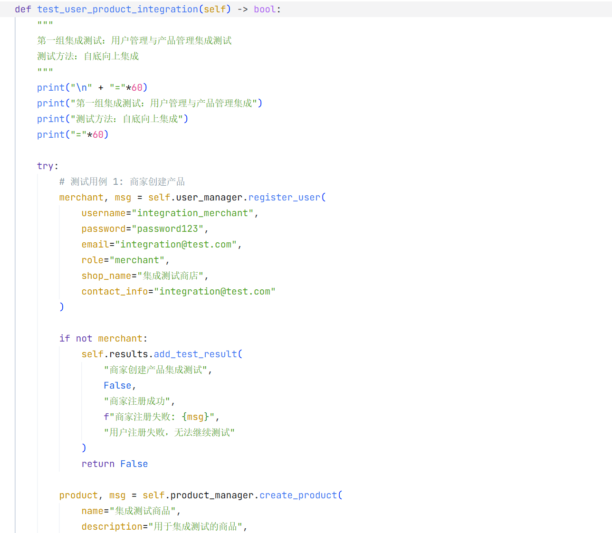
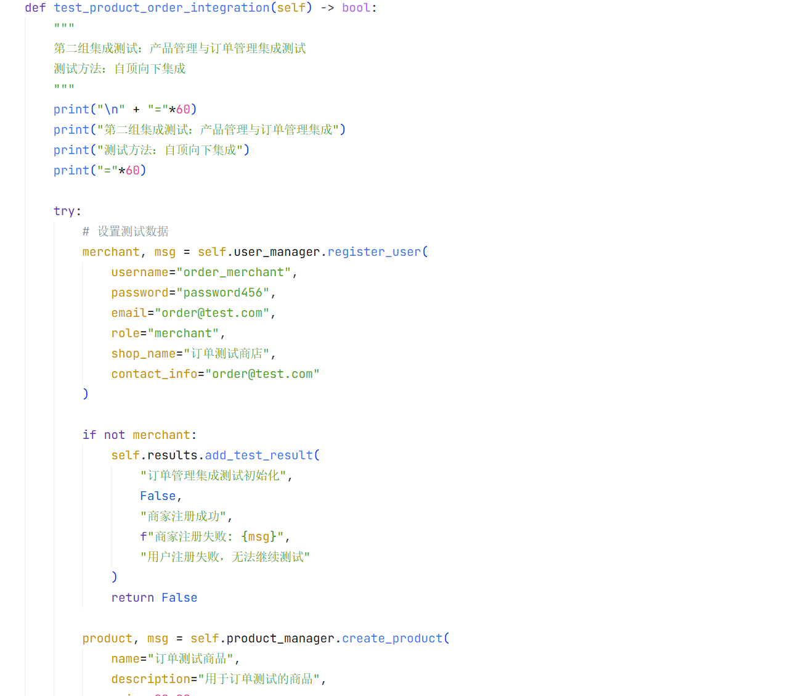
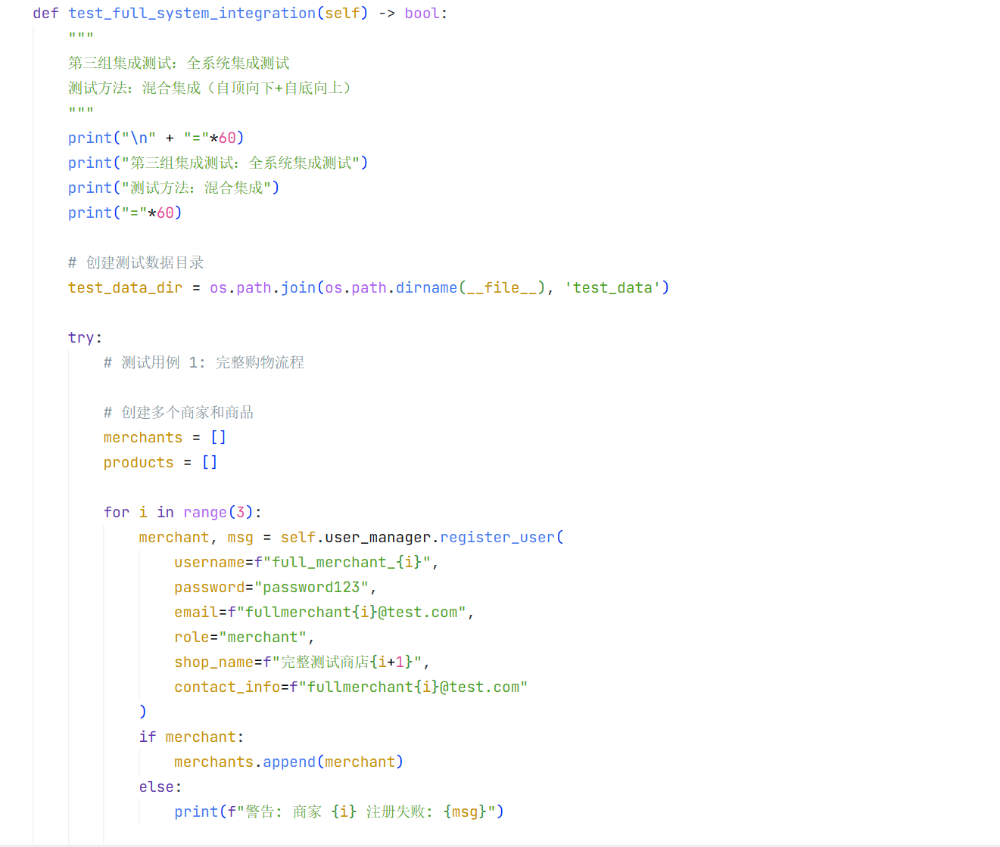
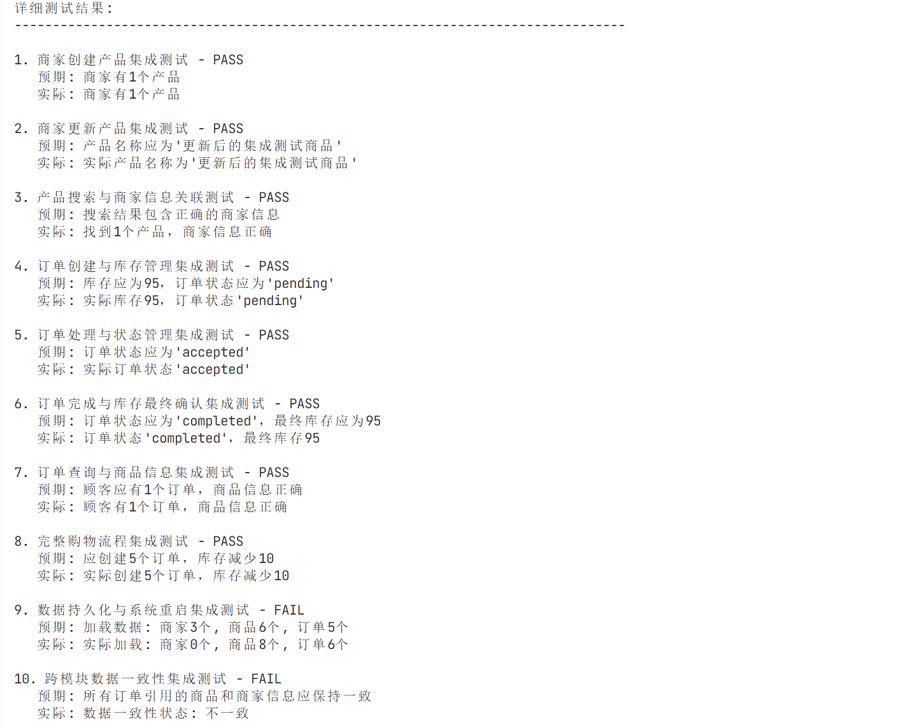

# online_mall_pre 集成测试分析报告

## 测试概述

**测试目的**：集成测试的核心作用是验证不同模块或组件协同工作时的正确性。它确保在单元测试通过的基础上，模块间的接口调用、数据传递和业务流程能够无缝衔接，暴露单元测试难以发现的交互错误、接口不匹配、数据一致性问题，以及跨模块的业务逻辑缺陷，从而保障系统的整体功能完整性和稳定性。
**测试环境**: 编程语言为python， 在虚拟机（Ubuntu 22.04）中进行测试, 用到Python 3.11.5, pytest 7.4.3  
**测试方法**: 沿用pytest框架
**测试方法**：自顶向下、自底向上、混合集成

（完整代码见附录intergration_test.py）

## 1. 测试一：用户管理与产品管理集成

### 1.1 测试方法
- **集成策略**：自底向上集成
- **测试目标**：验证用户管理和产品管理模块之间的交互

### 1.2 测试用例详细分析

#### 1.2.1 商家创建产品流程测试

| 测试用例 | 测试目的 | 预期输出 | 实际输出 | 测试结果 |
|---------|---------|---------|---------|---------|
| `商家创建产品集成测试` | 验证商家能够成功创建产品并建立关联 | 商家有1个产品 | 商家有1个产品 | PASS |

#### 1.2.2 商家更新产品信息测试

| 测试用例 | 测试目的 | 预期输出 | 实际输出 | 测试结果 |
|---------|---------|---------|---------|---------|
| `商家更新产品集成测试` | 验证商家能够更新产品信息并保持关联 | 产品名称应为'更新后的集成测试商品' | 实际产品名称为'更新后的集成测试商品' | PASS |

#### 1.2.3 产品搜索与商家信息关联测试

| 测试用例 | 测试目的 | 预期输出 | 实际输出 | 测试结果 |
|---------|---------|---------|---------|---------|
| `产品搜索与商家信息关联测试` | 验证产品搜索功能能够正确显示商家信息 | 搜索结果包含正确的商家信息 | 找到1个产品，商家信息正确 | PASS |

## 2. 测试二：产品管理与订单管理集成

### 2.1 测试方法
- **集成策略**：自顶向下集成
- **测试目标**：验证产品管理和订单管理模块之间的交互

### 2.2 测试用例详细分析

#### 2.2.1 订单创建与库存管理集成测试

| 测试用例 | 测试目的 | 预期输出 | 实际输出 | 测试结果 |
|---------|---------|---------|---------|---------|
| `订单创建与库存管理集成测试` | 验证订单创建时库存正确减少 | 库存应为95，订单状态应为'pending' | 实际库存95，订单状态'pending' | PASS |

#### 2.2.2 订单处理与状态管理集成测试

| 测试用例 | 测试目的 | 预期输出 | 实际输出 | 测试结果 |
|---------|---------|---------|---------|---------|
| `订单处理与状态管理集成测试` | 验证订单处理功能正确更新订单状态 | 订单状态应为'accepted' | 实际订单状态'accepted' | PASS |

#### 2.2.3 订单完成与库存最终确认集成测试

| 测试用例 | 测试目的 | 预期输出 | 实际输出 | 测试结果 |
|---------|---------|---------|---------|---------|
| `订单完成与库存最终确认集成测试` | 验证订单完成时库存确认正确 | 订单状态应为'completed'，最终库存应为95 | 订单状态'completed'，最终库存95 | PASS |

#### 2.2.4 订单查询与商品信息集成测试

| 测试用例 | 测试目的 | 预期输出 | 实际输出 | 测试结果 |
|---------|---------|---------|---------|---------|
| `订单查询与商品信息集成测试` | 验证订单查询功能能够正确关联商品信息 | 顾客应有1个订单，商品信息正确 | 顾客有1个订单，商品信息正确 | PASS |

## 3. 集成测试组三：全系统集成测试

### 3.1 测试方法
- **集成策略**：混合集成（自顶向下+自底向上）
- **测试目标**：验证整个系统各模块间的综合交互

### 3.2 测试用例详细分析

#### 3.2.1 完整购物流程测试

| 测试用例 | 测试目的 | 预期输出 | 实际输出 | 测试结果 |
|---------|---------|---------|---------|---------|
| `完整购物流程集成测试` | 验证多个商家、多个商品、多用户的完整购物流程 | 应创建5个订单，库存减少10 | 实际创建5个订单，库存减少10 | PASS |

#### 3.2.2 数据持久化与系统重启集成测试

| 测试用例 | 测试目的 | 预期输出 | 实际输出 | 测试结果 |
|---------|---------|---------|---------|---------|
| `数据持久化与系统重启集成测试` | 验证系统重启后数据能够正确恢复 | 加载数据: 商家3个, 商品6个, 订单5个 | 实际加载: 商家0个, 商品8个, 订单6个 | FAIL |

#### 3.2.3 跨模块数据一致性测试

| 测试用例 | 测试目的 | 预期输出 | 实际输出 | 测试结果 |
|---------|---------|---------|---------|---------|
| `跨模块数据一致性集成测试` | 验证订单中的商品和商家信息与当前数据一致 | 所有订单引用的商品和商家信息应保持一致 | 数据一致性状态: 不一致 | FAIL |

## 集成测试执行结果

## 失败测试用例分析

1. **数据持久化与系统重启集成测试**：
   - 预期加载商家3个，实际加载商家0个
   - 预期加载商品6个，实际加载商品8个
   - 预期加载订单5个，实际加载订单6个
   - 系统重启后数据加载逻辑存在问题

2. **跨模块数据一致性集成测试**：
   - 检查了6个订单的数据完整性
   - 发现订单引用的商品或商家信息与当前数据不一致
   - 数据更新时未同步所有相关模块的数据

